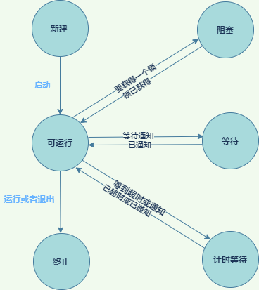

## 1 接口、表达式和内部类

### 1.1 接口

* 接口的方法自动加上public 所以不必提供关键字
* 接口中可以自定义常量
* 接口中可以有default方法，但是在实现类中重写就需要public关键字
* 接口中的字段总是 public static final 修饰
* Java 语言规范不建议 接口 方法和字段加修饰符
* 接口对于抽象类的优势可以实现类似多继承
* 默认方法的出现是为了解决 "源代码兼容"，因为已有的实现类可以不实现默认方法
* 类实现多个接口，接口中存在相同的默认方法(可以有不是默认的方法)，出现二义性，实现类必须重写，这样接口里的默认方法就被覆盖，不重写编译不通过
* 多重集成，遇到二义性问题，类优先原则,类优先原则也是保证兼容性

### 1.2 接口回调

### 1.3 克隆

* JDK 中的clone是浅拷贝，并且子类必须实现 Cloneable 接口，否则调用会抛异常

### 1.4 lambda 表达式

* 语法定义代码块
* 空参也需要小括号
* 接口只有一个方法
* 表达式里的变量 final 修饰，是最终变量

### 1.5 代理类

* 代理类在运行过程中动态创建,创建之后就是一个常规类
* Proxy 构造实例需要传入InvocationHandler,最终调用 invoke
* 代码如下

```java
public class TestProxy {
    public static void main(String[] args) {
        People people = new Man();
        People proxyInstance = (People) Proxy.newProxyInstance(ClassLoader.getSystemClassLoader(), new Class[]{People.class}, new Worker(people));
        proxyInstance.say();
    }
}

interface People {
    void say();
}


class Man implements People {

    @Override
    public void say() {
        System.out.println("MEN");
    }
}

class Worker implements InvocationHandler {

    //被代理的对象
    public Object obj;

    public Worker(Object obj) {
        this.obj = obj;
    }

    @Override
    public Object invoke(Object proxy, Method method, Object[] args) throws Throwable {
        System.out.println("before");
        //执行代理对象的方法
        Object invoke = method.invoke(obj, args);
        System.out.println("after");
        return invoke;
    }
}


```

## 2 异常、断言和日志

### 2.1 异常

#### 2.1.1 异常考虑范围

* 用户输入错误
* 设备错误：网络、硬件设备等
* 物理限制：磁盘，内存等
* 代码错误：代码出现的错误

#### 2.1.2 异常的类别

Throwable的兩個分支

* Exception 分为RuntimeException 和 IOException
* Error 内部错误和资源耗尽错误

#### 2.1.3 注意事项

* 子类异常范围不能大于父类
* 父类没有异常，子类也不能抛出异常
* 抛出的异常必须是Throwable的子类
* 异常的定义建议包含两个构造器，默认构造器和带异常消息的构造器
* 处理异常的方式为捕获异常和向外层抛出，捕获后可以再次抛出
* 可以捕获多个异常
* finally中不要有return、throw、break、continue,return会覆盖原有的返回值，在执行返回之前会执行finally代码块
* finally 一般用于释放资源

#### 2.1.4 处理异常的6个建议(书中描述的不一定对)

- 1.异常处理不能代替简单测试，只有在有异常的情况下再使用异常，捕获异常会消耗资源
- 2.不要过分的细化异常
- 3.充分利用异常的层次结构，合理的定义自己的异常并在合适的地方处理
- 4.不要压制异常 对于很少出现的异常，没有处理的化，编译器会报错
- 5.在检测异常时、苛刻比放任好
- 6.不要羞于传递异常

 --------------------------

- 建议不要再程序中使用断言，断言可以在运行程序时指定 参数开启或者关闭
- 5、6总结就是早捕获、晚抛出

### 2.2 日志

## 3 泛型

* 定义参考 类 `TreeUtils` `TreeModel`
* 泛型类 `Person<T>` 便是
* 泛型方法
* 类型擦除，虚拟机机制
* 泛型类不能用于类型检查 `instance of`
* 不支持泛型类型数组 `Person<T>[]`
* 不能 `new T ()`
* 不能有 static 修饰 T `public static T t`
* 泛型类不能继承 异常
* 通配符类型 ?
* 类泛型 Class<T>

## 4 集合

### 4.1 队列 Queue

* 先进先出
* 双端对了 Deque
* 底层数据结构分为 循环数组和链表。循环数组用于元素个数确定的场景，效率高，链表用于数据个数不确定的场景
* for each 是带迭代器的循环

### 4.2 集合

* 随机访问特性所致，遍历数组支持的有序列表，使用for循环，遍历链表支持的列表用迭代器。
* LinkList在get时，会先判断获取元素的位置和二分之一长度，如果大于该值，则从前向后搜素
* Set集合不存储重复元素，需要元素的equals方法支持，hashCode方法的定义要保证相同元素的2个集合会得到相同的散列码
* HashSet散列集 部分源码如下

```java
public class HashSet<V> {

    final V putVal(int hash, K key, V value, boolean onlyIfAbsent,
                   boolean evict) {
        Node<K, V>[] tab;
        Node<K, V> p;
        int n, i;
        //空集初始换
        if ((tab = table) == null || (n = tab.length) == 0)
            n = (tab = resize()).length;
        //值不存在直接加入
        if ((p = tab[i = (n - 1) & hash]) == null)
            tab[i] = newNode(hash, key, value, null);
            //转换结构
        else {
            Node<K, V> e;
            K k;
            if (p.hash == hash &&
                    ((k = p.key) == key || (key != null && key.equals(k))))
                e = p;
            else if (p instanceof TreeNode)
                e = ((TreeNode<K, V>) p).putTreeVal(this, tab, hash, key, value);
            else {
                for (int binCount = 0; ; ++binCount) {
                    if ((e = p.next) == null) {
                        p.next = newNode(hash, key, value, null);
                        if (binCount >= TREEIFY_THRESHOLD - 1) // -1 for 1st
                            treeifyBin(tab, hash);
                        break;
                    }
                    if (e.hash == hash &&
                            ((k = e.key) == key || (key != null && key.equals(k))))
                        break;
                    p = e;
                }
            }
            if (e != null) { // existing mapping for key
                V oldValue = e.value;
                if (!onlyIfAbsent || oldValue == null)
                    e.value = value;
                afterNodeAccess(e);
                return oldValue;
            }
        }
        ++modCount;
        //扩容
        if (++size > threshold)
            //再散列
            resize();
        afterNodeInsertion(evict);
        return null;
    }


}

```

* TreeSet 有序集，元素需要实现可比较接口，或者再创建时传入比较器，查找重复元素效率高

* 具体集合如下

  | Name              |      feature                   |
                                              |-----------------  | ------------------------------ |
  |ArrayList          |可以动态增长和缩减的一个索引序列   |  
  |LinkList           |可以在任何位置高效的插入和删除的一个有序序列|
  |ArrayDeque         |实现为一个循环数组的双端队列|
  |HashSet            |没有重复元素的无序集合|
  |TreeSet            |没有重复元素的有序集|
  |EnumSet            |枚举类型的集合|
  |LinkedHashSet      |一个可以记住元素插入次序的集合|
  |PriorityQueue      |允许高效删除最小元素的队列(优先队列，内部使用 二叉树，并不需要排序)|
  |HashMap            |存储键值关系的数据结构|
  |TreeMap            |键有序的映射|
  |EnumMap            |键属于枚举类型的映射|
  |LinkedHashMap      |可以记住键值添加次序的映射|
  |WeakHashMap        |值不会在别处使用时就被垃圾回收的一个映射|
  |IdentityHashMap    |用 == 而不是用equals比较的一个映射|

### 4.3 迭代器

* 迭代器在2个数据节点之间，调用 next时，迭代器就会跨过下一个元素，并返回这个元素的引用
* 如何在一个LinkedList的头部添加元素？从后向前遍历?

```java

public class LinkedListTest {

    public static void main(String[] args) {
        LinkedList<Integer> list = new LinkedList<>();
        list.add(1);
        list.add(2);
        list.add(3);
        list.add(4);

        System.out.println(list);
        ListIterator<Integer> iterator = list.listIterator();
        iterator.add(5);
        System.out.println(list);
        list.add(0, 6);
        System.out.println(list);
    }
}

public class LinkedListTest {

    public static void main(String[] args) {
        LinkedList<Integer> list = new LinkedList<>();
        list.add(1);
        list.add(2);
        list.add(3);
        list.add(4);

        System.out.println(list);
        ListIterator<Integer> iterator = list.listIterator();


        while (iterator.hasNext()) {
            Integer next = iterator.next();
            System.out.println(next);
        }

        while (iterator.hasPrevious()) {
            Integer previous = iterator.previous();
            System.out.println(previous);

        }
    }
}

```

### 4.4 映射

* HashTable 散列表 源码解析如下

```java
public class Hashtable<K, V> {

    public synchronized V put(K key, V value) {
        // Make sure the value is not null
        if (value == null) {
            throw new NullPointerException();
        }

        // Makes sure the key is not already in the hashtable.
        Entry<?, ?> tab[] = table;
        //计算hash值
        int hash = key.hashCode();
        //区域计算得到索引位置
        int index = (hash & 0x7FFFFFFF) % tab.length;
        @SuppressWarnings("unchecked")
        Entry<K, V> entry = (Entry<K, V>) tab[index];

        //如果找到已存在的相同KEY,覆盖并返回旧值
        for (; entry != null; entry = entry.next) {
            if ((entry.hash == hash) && entry.key.equals(key)) {
                V old = entry.value;
                entry.value = value;
                return old;
            }
        }

        //否者将其添加
        addEntry(hash, key, value, index);
        return null;
    }

    private void addEntry(int hash, K key, V value, int index) {
        modCount++;

        Entry<?, ?> tab[] = table;
        //检查容量是否需要扩容
        if (count >= threshold) {
            // Rehash the table if the threshold is exceeded
            //扩容  
            rehash();

            tab = table;
            hash = key.hashCode();
            index = (hash & 0x7FFFFFFF) % tab.length;
        }

        //不需要扩容直接创建并加入元素
        // Creates the new entry.
        @SuppressWarnings("unchecked")
        Entry<K, V> e = (Entry<K, V>) tab[index];
        tab[index] = new Entry<>(hash, key, value, e);
        count++;
    }


    @SuppressWarnings("unchecked")
    public synchronized V get(Object key) {
        Entry<?, ?> tab[] = table;
        int hash = key.hashCode();
        int index = (hash & 0x7FFFFFFF) % tab.length;
        for (Entry<?, ?> e = tab[index]; e != null; e = e.next) {
            if ((e.hash == hash) && e.key.equals(key)) {
                return (V) e.value;
            }
        }
        return null;
    }
}

```

### 4.5 算法

* Java 集合使用的时归并排序，先将集合的数据复制到数组里，再排序，归并排序比快速排序慢一些，但是更稳定，不会出现相同元素位置调换的情况
* 二分查找
* 获取极值

### 4.6 栈

## 5 并发编程

### 5.1 一些概念

* 线程、进程、时间片、共享变量、抢占式调度系统
* 线程的6个状态

```java

public enum State {
    /**
     * Thread state for a thread which has not yet started.
     * 尚未启动的线程的线程状态。
     */
    NEW,

    /**
     * Thread state for a runnable thread.  A thread in the runnable
     * state is executing in the Java virtual machine but it may
     * be waiting for other resources from the operating system
     * such as processor.
     *
     * 可运行线程的线程状态。处于可运行状态的线程正在 Java 虚拟机中执行，
     * 但它可能正在等待来自操作系统的其他资源，例如处理器
     */
    RUNNABLE,

    /**
     * Thread state for a thread blocked waiting for a monitor lock.
     * A thread in the blocked state is waiting for a monitor lock
     * to enter a synchronized block/method or
     * reenter a synchronized block/method after calling
     * {@link Object#wait() Object.wait}.
     *
     * 线程阻塞等待监视器锁的线程状态。处于阻塞状态的线程正在等待监视器锁进入同步块方法或调用后重新进入同步块方法
     */
    BLOCKED,

    /**
     * Thread state for a waiting thread.
     * A thread is in the waiting state due to calling one of the
     * following methods:
     * <ul>
     *   <li>{@link Object#wait() Object.wait} with no timeout</li>
     *   <li>{@link #join() Thread.join} with no timeout</li>
     *   <li>{@link LockSupport#park() LockSupport.park}</li>
     * </ul>
     *
     * <p>A thread in the waiting state is waiting for another thread to
     * perform a particular action.
     *
     * For example, a thread that has called <tt>Object.wait()</tt>
     * on an object is waiting for another thread to call
     * <tt>Object.notify()</tt> or <tt>Object.notifyAll()</tt> on
     * that object. A thread that has called <tt>Thread.join()</tt>
     * is waiting for a specified thread to terminate.
     */
    //等待状态
    WAITING,

    /**
     * Thread state for a waiting thread with a specified waiting time.
     * A thread is in the timed waiting state due to calling one of
     * the following methods with a specified positive waiting time:
     * <ul>
     *   <li>{@link #sleep Thread.sleep}</li>
     *   <li>{@link Object#wait(long) Object.wait} with timeout</li>
     *   <li>{@link #join(long) Thread.join} with timeout</li>
     *   <li>{@link LockSupport#parkNanos LockSupport.parkNanos}</li>
     *   <li>{@link LockSupport#parkUntil LockSupport.parkUntil}</li>
     * </ul>
     */
    //计时等待状态
    TIMED_WAITING,

    /**
     * Thread state for a terminated thread.
     * The thread has completed execution.
     *
     * 已终止线程的线程状态。线程已完成执行。
     */
    TERMINATED;
}


```

### 5.2 线程状态

* 线程状态转换图



* 线程状态切换的一些方法

```java

public class ThreadTest {

    public static void main(String[] args) {
        //创建线程
        Thread thread = new ThreadExample();
        thread.setName("线程1");
        thread.start();


        Thread.currentThread().setName("主线程");
        for (int i = 0; i < 100; i++) {
            System.out.println(Thread.currentThread().getName() + ":" + i);

            if (i == 40) {
                try {
                    //线程获得执行权，并且直到执行完
                    thread.join();
                } catch (InterruptedException e) {
                    e.printStackTrace();
                }
            }

            if (i == 50) {
                //尝试中断线程 stop 方法已废弃
                thread.interrupt();
                System.out.println(thread.isInterrupted());
            }
        }


    }
}


class ThreadExample extends Thread {

    @Override
    public void run() {
        System.out.println("ThreadExample:::" + Thread.currentThread().getName());
        System.out.println("ThreadExample RUN !");
        for (int i = 0; i < 100; i++) {
            System.out.println(Thread.currentThread().getName() + ":" + i);
            //如果条件满足，当前线程让出执行权
            if (i == 20) {
                Thread.yield();
            }
        }
    }
}

```

### 5.3 线程的一些属性

* 中断线程：线程执行 return 之前，出现未捕获的异常，线程就会中断。当线程被一个 sleep或者wait阻塞时，调用interrupt方法，阻塞线程会被InterruptedException中断。
* 守护线程：计时器是一种守护线程,当程序中只有守护线程时，虚拟机就会退出
* 线程由于异常死亡，在死亡之前异常会传递到一个用于处理未捕获异常的处理器(`java.lang.Thread.UncaughtExceptionHandler`)。单个线程没有默认的 捕获异常的处理器。线程组有。
* 线程优先级  `thread.setPriority()` 1-10之间，Window系统有7个优先级,Linux没有优先级的概念。所以现在不要使用线程优先级
* 线程同步：同步方法，同步代码块，可重入锁
* 条件对象 : `Condition` ,调用 await之后，线程处于阻塞状态，需要其他线程调用 signAll方法，重新激活。自己是无法激活的，会造成死锁现象
* 一个锁可以有多个关联的条件对象
* validate 关键字 不能保证 `done = !done` 的原子性，原因如下：

```java

public class AtomicTest {

    public AtomicLong value = new AtomicLong(100);
    public boolean b = true;
    public int a = 1;

    public static void main(String[] args) {


    }

    public void intTest() {
        a++;

    }

    public void boolTest() {
        b = !b;
    }

    public void AtomicLongTest() {
        //这种代码是不可行的 TODO 原因？
        value.set(Math.max(value.get(), 10));
        //正确姿势
        value.updateAndGet(x -> Math.max(value.get(), 10));
        //或者
        value.accumulateAndGet(10, Math::max);
    }


}


```

汇编指令

```text

 javap -c -l .\AtomicTest.class
 
 public class com.wang.multithing.AtomicTest {
  public java.util.concurrent.atomic.AtomicLong value;

  public boolean b;

  public int a;

  public com.wang.multithing.AtomicTest();
    Code:
       0: aload_0
       1: invokespecial #1                  // Method java/lang/Object."<init>":()V
       4: aload_0
       5: new           #2                  // class java/util/concurrent/atomic/AtomicLong
       8: dup
       9: ldc2_w        #3                  // long 100l
      12: invokespecial #5                  // Method java/util/concurrent/atomic/AtomicLong."<init>":(J)V
      15: putfield      #6                  // Field value:Ljava/util/concurrent/atomic/AtomicLong;
      18: aload_0
      19: iconst_1
      20: putfield      #7                  // Field b:Z
      23: aload_0
      24: iconst_1
      25: putfield      #8                  // Field a:I
      28: return
    LineNumberTable:
      line 5: 0
      line 7: 4
      line 8: 18
      line 9: 23
    LocalVariableTable:
      Start  Length  Slot  Name   Signature
          0      29     0  this   Lcom/wang/multithing/AtomicTest;

  public static void main(java.lang.String[]);
    Code:
       0: return
    LineNumberTable:
      line 14: 0
    LocalVariableTable:
      Start  Length  Slot  Name   Signature
          0       1     0  args   [Ljava/lang/String;
  
 
  public void intTest();
    Code:
       0: aload_0
       1: dup
       2: getfield      #8                  // Field a:I
       5: iconst_1
       6: iadd
       7: putfield      #8                  // Field a:I
      10: return
    LineNumberTable:
      line 17: 0
      line 19: 10
    LocalVariableTable:
      Start  Length  Slot  Name   Signature
          0      11     0  this   Lcom/wang/multithing/AtomicTest;

  public void boolTest();
    Code:
       0: aload_0
       1: aload_0
       2: getfield      #7                  // Field b:Z
       5: ifne          12
       8: iconst_1
       9: goto          13
      12: iconst_0
      13: putfield      #7                  // Field b:Z
      16: return
    LineNumberTable:
      line 22: 0
      line 23: 16
    LocalVariableTable:
      Start  Length  Slot  Name   Signature
          0      17     0  this   Lcom/wang/multithing/AtomicTest;

  public void AtomicLongTest();
    Code:
       0: aload_0
       1: getfield      #6                  // Field value:Ljava/util/concurrent/atomic/AtomicLong;
       4: aload_0
       5: getfield      #6                  // Field value:Ljava/util/concurrent/atomic/AtomicLong;
       8: invokevirtual #9                  // Method java/util/concurrent/atomic/AtomicLong.get:()J
      11: ldc2_w        #10                 // long 10l
      14: invokestatic  #12                 // Method java/lang/Math.max:(JJ)J
      17: invokevirtual #13                 // Method java/util/concurrent/atomic/AtomicLong.set:(J)V
      20: aload_0
      21: getfield      #6                  // Field value:Ljava/util/concurrent/atomic/AtomicLong;
      24: aload_0
      25: invokedynamic #14,  0             // InvokeDynamic #0:applyAsLong:(Lcom/wang/multithing/AtomicTest;)Ljava/util/function/LongUnaryOperator;
      30: invokevirtual #15                 // Method java/util/concurrent/atomic/AtomicLong.updateAndGet:(Ljava/util/function/LongUnaryOperator;)J
      33: pop2
      34: aload_0
      35: getfield      #6                  // Field value:Ljava/util/concurrent/atomic/AtomicLong;
      38: ldc2_w        #10                 // long 10l
      41: invokedynamic #16,  0             // InvokeDynamic #1:applyAsLong:()Ljava/util/function/LongBinaryOperator;
      46: invokevirtual #17                 // Method java/util/concurrent/atomic/AtomicLong.accumulateAndGet:(JLjava/util/function/LongBinaryOperator;)J
      49: pop2
      50: return
    LineNumberTable:
      line 27: 0
      line 29: 20
      line 31: 34
      line 32: 50
    LocalVariableTable:
      Start  Length  Slot  Name   Signature
          0      51     0  this   Lcom/wang/multithing/AtomicTest;
}

```

**【2、5、6】3行才完成 i++的过程**  
**【2、5、8、12】4行才完成 b=!b的过程**
真正执行的过程中不是原子操作就会出现线程安全问题

* 原子类 `java.util.concurrent.atomic` 包路径下的类代码演示

```java
public class AtomicLongTest {

    public static AtomicLong value = new AtomicLong(100);

    public static void main(String[] args) {

        //这种代码是不可行的 TODO 原因？
        value.set(Math.max(value.get(), 10));
        //正确姿势
        value.updateAndGet(x -> Math.max(value.get(), 10));
        //或者
        value.accumulateAndGet(10, Math::max);
    }
}

```

* 计数器可以使用 LongAdder 类去做，高并发下效率高
* 线程局部变量 ThreadLocal

````java

public class ThreadLocalTest {

    public static void main(String[] args) throws InterruptedException {
        CountDownLatch countDownLatch = new CountDownLatch(2);
        NameHolder.setName("hello");

        ExecutorService one = Executors.newSingleThreadExecutor();
        one.execute(() -> {
            countDownLatch.countDown();
            //每个线程只能获取自己内部设置的值
            NameHolder.setName("world");
            //输出 world
            System.out.println(Thread.currentThread().getName() + ":" + NameHolder.getName());
        });
        ExecutorService two = Executors.newSingleThreadExecutor();

        two.execute(() -> {
            //此线程为null
            countDownLatch.countDown();
            //输出NUll
            System.out.println(Thread.currentThread().getName() + ":" + NameHolder.getName());
        });

        countDownLatch.await();
        //输出 Hello
        System.out.println(Thread.currentThread().getName() + ":" + NameHolder.getName());
        one.shutdown();
        two.shutdown();
    }
}


class NameHolder {
    private static ThreadLocal<String> local = new ThreadLocal<>();

    public static void setName(String value) {
        local.set(value);
    }

    public static String getName() {
        return local.get();
    }

    public void removeName() {
        local.remove();
    }
}

````

### 5.4 线程安全集合

* 很多时候可以用一个或者多个阻塞队列安全的从国歌线程间传输数据，一个生产线程向队列里存数据，在各个其他线程从队列里获取数据.
* 阻塞队列 add remove element 方法当队列已满或者为空时会抛出异常，用offer poll和 peek替代，这三个方法会警告提示,在合适的场景选用对应的方法
* 并发包类 TODO 示例 CAS 算法 （硬件级别的原子性保证）失败重试 1.8大部分改成 CAS 算法
    * `Atomic*` volatile 和 这些类的线程安全时虚拟机的本地方法去保证
    * `LinkedBlockingDeque` 阻塞双向链表队列 ReentrantLock 、Condition、
    * `LinkedBlockingQueue` 阻塞单链表队列 多个ReentrantLock、 Condition
    * `ArrayBlockingQueue`  数组类型支持的阻塞队列 ReentrantLock 、Condition
    * `DelayQueue` 延时队列 ReentrantLock PriorityQueue Thread Condition
    * `CopyOnWriteArraySet` ReentrantLock 、 Object[] 实现线程安全、读写分离操作 添加操作多时，会大量复制，效率低
    * `CopyOnWriteArrayList` 同 `CopyOnWriteArraySet`
    * `ConcurrentSkipListSet` 并发跳跃不可重复集合，维护层级关系，并没有做线程安全处理。内部用`ConcurrentSkipListMap` 维护数据结构关系
    * `ConcurrentSkipListMap` 并发跳跃映射 内部 volatile 关键字支撑线程安全
    * `ConcurrentLinkedQueue` 并发单向链表队列，volatile 关键字支撑线程安全
    * `ConcurrentLinkedDeque` 并发塞双向链表队列 volatile 关键字支撑线程安全
    * `ConcurrentHashMap` 并发散列映射 volatile Segment(分段锁机制)实现了ReentrantLock
    * `Collections.synchronized*` 并发操作会异常
    * `CountDownLatch` 闭锁，用于等到所有线程执行完成，CountDownLatch 每一个线程池需要单独的一个去维护

* Unsafe 类里的 final修饰的方法都是硬件级别 CAS 算法的体现 但是为什么是 Unsafe 不安全的原因可能是操作会失败 而不是值的并发操作不安全
* 读写锁 ReadWriteLock是ReentrantLock实现的读写分离，并发读，安全写的一种锁

```java
public class ReadWriteLockTest {


    public static void main(String[] args) throws InterruptedException {
        ExecutorService writer = Executors.newFixedThreadPool(5);
        ExecutorService reader = Executors.newFixedThreadPool(10);
        ReadWriteLockWorker worker = new ReadWriteLockWorker();
        //CountDownLatch需要分别设置
        CountDownLatch writeCount = new CountDownLatch(100);
        CountDownLatch readCount = new CountDownLatch(100);
        for (int i = 0; i < 100; i++) {
            int finalI = i;
            writer.execute(() -> {
                writeCount.countDown();
                worker.writeNumber(finalI);
            });
        }

        for (int i = 0; i < 100; i++) {
            writeCount.countDown();
            reader.execute(() -> {
                readCount.countDown();
                worker.readNumber();
            });
        }

        writeCount.await();
        readCount.await();
        System.out.println(worker.countRead);
        System.out.println(worker.countRead);
        writer.shutdown();
        reader.shutdown();

    }
}


class ReadWriteLockWorker {

    private int number = 100;

    //由于琐事可重入
    ReadWriteLock lock = new ReentrantReadWriteLock();

    AtomicInteger countRead = new AtomicInteger();
    AtomicInteger countWrite = new AtomicInteger();

    public void readNumber() {
        try {
            lock.readLock().lock();
            countRead.incrementAndGet();
            System.out.println("读：" + Thread.currentThread().getName() + ":" + number);
        } finally {
            lock.readLock().unlock();
        }
    }

    public void writeNumber(int value) {
        try {
            lock.writeLock().lock();
            number = value;
            countWrite.incrementAndGet();
            System.out.println("写：" + Thread.currentThread().getName() + ":" + number);
        } finally {
            lock.writeLock().unlock();
        }
    }
}


```

* 线程8锁 synchronized 关键字底层依然是锁的机制
    * 非静态方法锁默认是 this,静态方法 是 Class 类实例
    * 一个时刻内，只用有一个线程持有 锁，和方法无关
* 线程池 维护了一个线程队列
    * Executors.*
    * ThreadPoolExecutor
    * 创建示例

```java
public class ThreadPoolTest {

    public static void main(String[] args) {
        ExecutorService executor = Executors.newSingleThreadExecutor();
        ThreadPoolExecutor poolExecutor = new ThreadPoolExecutor(
                1,
                1,
                0L, TimeUnit.MILLISECONDS,
                new LinkedBlockingQueue<Runnable>());
    }
}


```

* 注意：线程池使用玩需要关闭
* Future :future.get()会阻塞线程，等待线程任务都已完成

```java

public class FutureTest {

    public static int sum = 0;


    public static void main(String[] args) throws ExecutionException, InterruptedException {
        ExecutorService pool = Executors.newFixedThreadPool(5);
        Future<Integer> future = null;
        for (int i = 0; i <= 100; i++) {

            int finalI = i;
            future = pool.submit(new Callable<Integer>() {
                @Override
                public Integer call() {
                    System.out.println(finalI);
                    return sum += finalI;
                }
            });
        }
        // future.get()会阻塞线程，等待线程任务都已完成
        Integer r = future.get();
        pool.shutdown();
        System.out.println("=====" + sum);
    }
}

```

* ScheduledExecutorService
* ForkJoinPool 测试

```text
//输出耗时结果
PT0.081S
500000000500000000
PT0.217S
500000000500000000
```

```java
//代码示例
public class ForkJoinTest {
    
    public static void main(String[] args) throws ExecutionException, InterruptedException {
        ForkJoinPool forkJoinPool = new ForkJoinPool();
        long l = 1000000000L;
        Instant start = Instant.now();
        ForkJoinTask<Long> result = forkJoinPool.submit(new Worker(1, l));
        //阻塞
        Long aLong = result.get();
        forkJoinPool.shutdown();
        Instant end = Instant.now();
        System.out.println(Duration.between(start, end));
        System.out.println(aLong);

        long sum = 0;
        Instant start1 = Instant.now();
        for (long i = 0; i <= l; i++) {
            sum += i;
        }
        Instant end1 = Instant.now();
        System.out.println(Duration.between(start1, end1));
        System.out.println(sum);
    }
}

class Worker extends RecursiveTask<Long> {

    private final long start;
    private final long end;
    long sum;

    //超过10000分解任务
    public static final long FLAG = 10000L;

    Worker(long start, long end) {
        this.start = start;
        this.end = end;
    }

    @Override
    protected Long compute() {
        long len = end - start;
        if (len <= FLAG) {
            for (long i = start; i <= end; i++) {
                sum += i;
            }
            return sum;
        } else {
            //递归拆分任务
            long mid = (start + end) / 2;
            Worker left = new Worker(start, mid);
            left.fork();
            Worker right = new Worker(mid + 1, end);
            right.fork();
            return left.join() + right.join();
        }
    }
}

```