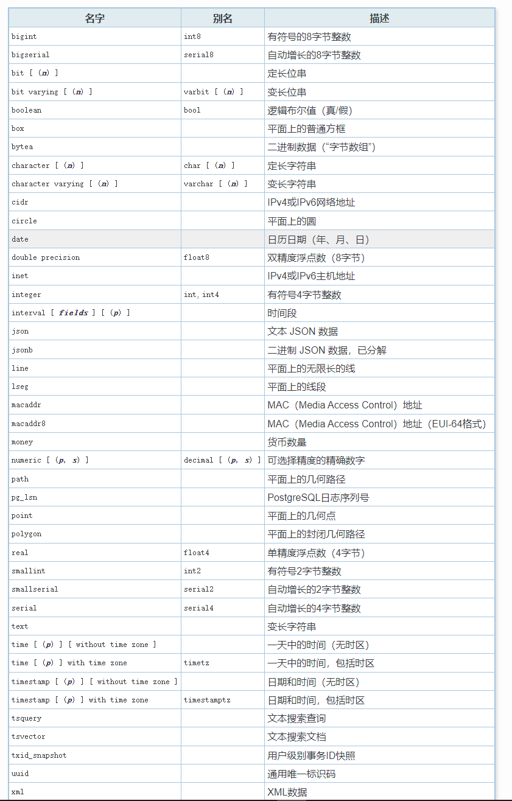

## 重点梳理

##### PostgreSQL数据类型

#### 表的存储属性 TOAST 压缩机制

* 有时就会产生一个有趣的现象，即数据多的表反而占用空间少。
* 所以需要对更新频繁的表设置一个较小的fillfactor值。
* 通过表继承实现分区表
* 声明式分区 实现分表 

#### 执行计划

* EXPLAIN命令
* 全表扫描在PostgreSQL中也称顺序扫描（Seq Scan）
* 索引扫描 (Index Scan)
* 位图扫描 (Bitmap Index Scan、Bitmap Heap Scan)
* 条件过滤 (Filter)
* 散列连接 (Hash Join)
* 合并连接 (Merge Join)

#### 技术内幕
* PostgreSQL中的多版本并发控制
* PostgreSQL的循环覆盖写是通过把旧的WAL日志“重命名”来实现的。