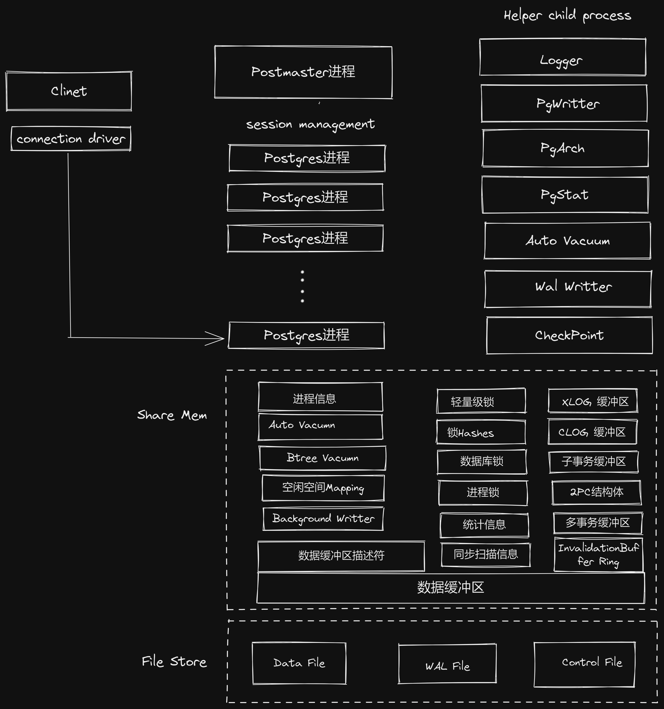

## 1、参考文档
* 官方文档 http://www.postgres.cn/v2/document
* 配置生成网站 https://pgtune.leopard.in.ua/
## 2、安装教程
* 安装脚本

```bash

    #!/bin/bash
    # 关闭防火墙
    systemctl stop firewalld
    systemctl disable firewalld
    
    # 关闭selinux
    sed -i 's/enforcing/disabled/' /etc/selinux/config  # 永久
    setenforce 0  # 临时
    
    # 关闭swap
    swapoff -a  # 临时
    sed -ri 's/.*swap.*/#&/' /etc/fstab    # 永久
    
    # 时间同步
    yum install ntpdate
    ntpdate time.windows.com
    
    #安装源
    sudo yum install https://download.postgresql.org/pub/repos/yum/reporpms/EL-7-x86_64/pgdg-redhat-repo-latest.noarch.rpm
    yum search postgresql
    sudo yum install  postgresql12-server
    
    #数据库插件安装
    yum search contrib
    yum install postgresql12-contrib.x86_64
    
    
    lineNumber='grep -nr  "Environment=PGDATA" /usr/lib/systemd/system/postgresql-12.service | gawk '{print $1}' FS=":"'
    
    # TODO 这一行有BUG
    sed "${lineNumber}c Environment=PGDATA=/opt/data/postgres" /usr/lib/systemd/system/postgresql-12.service
    
    mkdir -p "/opt/data/postgres"
    
    sudo chown -R postgres:postgres /opt/data/postgres && chmod -R 750 /opt/data/postgres
    
    sudo /usr/pgsql-12/bin/postgresql-12-setup initdb
    sudo systemctl enable postgresql-12
    sudo systemctl start postgresql-12
```
* 配置文件
```bash
    #设置密码
    su - postgres
    psql
    \password
    exit
     
    #修改局域网连接
    修改文件
    pg_hba.conf
    host all all 0.0.0.0/0 md5
     
    postgresql.conf
    listen_addresses='*'
```

* StandBy主从安装
```bash
	#主库配置 
	#pg_hba.conf
	host    replication     all        0/0        md5  
  
	#postgresql.conf
	listen_addresses = '*'
	max_wal_senders = 10
	wal_level = replica
	
	#从库
	#执行备份命令 执行完备份命令，自动配置好了
	# $PGDATA 是环境变量，如果当前用户没有配置，需要自行配置，或者可以直接改成数据的真实目录
	pg_basebackup -h 10.0.3.101 -U postgres -F p -P -X stream -R -D $PGDATA -l osdbabackup201912151110
	
	#修改配置文件参数
	#postgresql.conf
	hot_standby=on
	
	#在主库检查是否成功
	select client_addr,state,sync_state from pg_stat_replication;
	
	#在从库查看日志
    tail -f log/postgresql-Sat.log
       
```
* 注意事项
 
  主库从库的内存、线程配置要保持一致，否则会有从库启动失败的情况

## 3、PostgreSQL数据类型
| 名字                                  | 别名             | 描述                                        |
| --------------------------------------- | ------------------ | --------------------------------------------- |
| bigint                                  | int8               | 有符号的8字节整数                     |
| bigserial                               | serial8            | 自动增长的8字节整数                  |
| bit [ (n) ]                             |                    | 定长位串                                  |
| bit varying [ (n) ]                     | varbit [ (n) ]     | 变长位串                                  |
| boolean                                 | bool               | 逻辑布尔值（真/假）                  |
| box                                     |                    | 平面上的普通方框                      |
| bytea                                   |                    | 二进制数据（“字节数组”）       |
| character [ (n) ]                       | char [ (n) ]       | 定长字符串                               |
| character varying [ (n) ]               | varchar [ (n) ]    | 变长字符串                               |
| cidr                                    |                    | IPv4或IPv6网络地址                       |
| circle                                  |                    | 平面上的圆                               |
| date                                    |                    | 日历日期（年、月、日）             |
| double precision                        | float8             | 双精度浮点数（8字节）               |
| inet                                    |                    | IPv4或IPv6主机地址                       |
| integer                                 | int, int4          | 有符号4字节整数                        |
| interval [ fields ] [ (p) ]             |                    | 时间段                                     |
| json                                    |                    | 文本 JSON 数据                            |
| jsonb                                   |                    | 二进制 JSON 数据，已分解             |
| line                                    |                    | 平面上的无限长的线                   |
| lseg                                    |                    | 平面上的线段                            |
| macaddr                                 |                    | MAC（Media Access Control）地址           |
| macaddr8                                |                    | MAC（Media Access Control）地址（EUI-64格式） |
| money                                   |                    | 货币数量                                  |
| numeric [ (p, s) ]                      | decimal [ (p, s) ] | 可选择精度的精确数字                |
| path                                    |                    | 平面上的几何路径                      |
| pg_lsn                                  |                    | PostgreSQL日志序列号                     |
| point                                   |                    | 平面上的几何点                         |
| polygon                                 |                    | 平面上的封闭几何路径                |
| real                                    | float4             | 单精度浮点数（4字节）               |
| smallint                                | int2               | 有符号2字节整数                        |
| smallserial                             | serial2            | 自动增长的2字节整数                  |
| serial                                  | serial4            | 自动增长的4字节整数                  |
| text                                    |                    | 变长字符串                               |
| time [ (p) ] [ without time zone ]      |                    | 一天中的时间（无时区）             |
| time [ (p) ] with time zone             | timetz             | 一天中的时间，包括时区             |
| timestamp [ (p) ] [ without time zone ] |                    | 日期和时间（无时区）                |
| timestamp [ (p) ] with time zone        | timestamptz        | 日期和时间，包括时区                |
| tsquery                                 |                    | 文本搜索查询                            |
| tsvector                                |                    | 文本搜索文档                            |
| txid_snapshot                           |                    | 用户级别事务ID快照                    |
| uuid                                    |                    | 通用唯一标识码                         |
| xml                                     |                    | XML数据                                     |
## 4、PostgreSQL数据库逻辑结构

##### 4.1 在一个PostgreSQL数据库系统中，数据的组织结构可以分为以下3层。
- 数据库：一个PostgreSQL数据库服务可以管理多个数据库，当应用连接到一个数据库时，
一般只能访问这个数据库中的数据，而不能访问其他数据库中的内容（除非使用DBLink等其他手段）。
- 表、索引：一个数据库中有很多表、索引。一般来说，在PostgreSQL中表的术语为`Relation`，而在其他数据库中则叫`Table`。
- 数据行：每张表中都有很多行数据。在PostgreSQL中行的术语一般为`Tuple`，而在其他数据库中则叫`Row`。

##### 4.2 模式（Schema）的概念
- 模式（Schema）是数据库中的一个概念，可以将其理解为一个命名空间或目录，不同的模式下可以有相同名称的表、函数等对象而不会产生冲突。提出模式的概念是为了便于管理，只要有权限，各个模式的对象可以互相调用。
- 在PostgreSQL中，一个数据库包含一个或多个模式，模式中又包含了表、函数以及操作符等数据库对象。在PostgreSQL中，不能同时访问不同数据库中的对象，当要访问另一个数据库中的表或其他对象时，需要重新连接到这个数据库，而模式却没有此限制，一个用户在连接到一个数据库后，就可以同时访问这个数据库中多个模式的对象。从这个特性来说，PostgreSQL中模式的概念与MySQL中的Database的概念是等价的，在MySQL中也可以同时访问多个Database中的对象，就与PostgreSQL中可以同时访问多个Schema中的对象是一样的。在Oracle数据库中，一个用户就对应一个Schema。大家在以后的学习过程中需要注意在不同的数据库系统（Oracle、MySQL）中Database、模式这些概念的不同。

#### 4.3 表的存储属性
- 只有当数据的长度超过2040字节（大约为一个BLOCK的四分之一）时，才会触发 `TOAST`压缩机制 对数据进行压缩。有时就会产生一个有趣的现象，即数据多的表反而占用空间少。例如：有两张表结构相同的表（A表和B表），往A表中插入的字段数据长度略小于2040字节，而B表中插入的某个字段数据长度略大于2040字节，你通常会发现字段内容更长的B表实际占用的空间却比A表小，这是由于B表触发了TOAST的压缩机制，压缩后的数据长度小于A表。

- 因为`Heap-Only Tuple`的链表不能跨数据块，如果新行必须插入新的数据块中，则无法使用到`Heap-Only Tuple`技术，这时就需要更新表上的全部索引了，这会产生很大的开销。所以需要对更新频繁的表设置一个较小的fillfactor值。
#### 4.4 表的种类
##### 4.4.1 临时表
- 会话级临时表：不同会话下相同的名称的临时表不是同一张表，会话关闭，表和数据都将销毁。默认创建的是会话级别临时表。会话隔离；
- 事务级别临时表：事务结束数据和表销毁，事务隔离。
- UNLOGGED表(半临时表)：不产生WAL日志，数据持久化，有可能丢失。
##### 4.4.2 表继承实现的分表
- 确保`constraint_exclusion`中的配置参数`postgresql.conf`是打开的。打开后，如果查询中WHERE子句的过滤条件与分区的约束条件匹配，那么该查询会智能地只查询此分区，而不会查询其他分区。
- 通过触发器或者规则将数据路由到分区表上
##### 4.4.3 声明式分区实现分表
#### 4.5 视图 可更新视图
#### 4.6 索引
#### 索引分类
- BTree：最常用的索引，BTree索引适合用于处理等值查询和范围查询。
- HASH：只能处理简单的等值查询。
- GiST：不是单独一种索引类型，而是一种架构，可以在这种架构上实现很多不同的索引策略。GiST索引定义的特定操作符可以用于特定索引策略。PostgreSQL的标准发布中包含了用于二维几何数据类型的GiST操作符类，比如，一个图形包含另一个图形的操作符“@>”，一个图形在另一个图形的左边且没有重叠的操作符“<<”，等等。
- SP-GiST：SP-GiST是“Space-Partitioned GiST”的缩写，即空间分区GiST索引。它是从PostgreSQL9.2版本开始提供的一种新索引类型，主要是通过一些新的索引算法来提高GiST索引在某种情况下的性能。
- GIN：反转索引，可以处理包含多个键的值，如数组等。与GiST类似，GIN支持用户定义的索引策略，可通过定义GIN索引的特定操作符类型实现不同的功能。PostgreSQL的标准发布中包含了用于一维数组的GIN操作符类，比如，它支持包含操作符“@>”、被包含操作符“<@”、相等操作符“=”、重叠操作符“&&”，等等。
- 还有插件定义的索引 可参考文档    
  [附录 F. 额外提供的模块](http://www.postgres.cn/docs/12/contrib.html)
- 部分索引：在该列的一部分数据上创建索引
- 表达式索引：如果查询条件里包含函数表达式，单纯的索引会失效，此时需要建立表达式索引
- BRIN索引：线性数据索引块
#### 注意：不能在数组上建普通的B树索引，需要建GIN索引
#### 并发索引创建
- 创建索引会锁表，扫描全表，导致增删改操作被阻塞。启用并发创建索引方式不会阻塞，但是会扫描2次表。修改索引时，由于一个字段上可以创建多个索引，可以先增加一新的，再将旧的删除掉。
## PostgreSQL事务特性、锁
### 事务特性
* 支持DDL事务
* 实际上只有4个隔离级别中的2个
* 2阶段提交
##### 8种表级锁：
最普通的共享锁`SHARE`和排它锁“`EXCLUSIVE`，因为多版本的原因，修改一条数据的同时允许读数据，所以为了处理这种情况，
又加了两种锁`ACCESS SHARE`和`ACESS EXCLUSIVE`，所以锁中的`ACCESS`这个关键字是与多版本读相关的。此外，为了处理表锁和行锁之间的关系，于是有了意向锁的概念，这时又加了两种锁，即意向共享锁和意向排它锁。这样就有了6种锁。由于意向锁之间不会产生冲突，而且意向排它锁互相之间也不会产生冲突，
于是又需要更严格一些的锁，这样就产生了`SHARE UPDATE EXCLUSIVE`和`SHARE ROW EXCLUSIVE`两种锁，于是就有了8种锁。
##### 2种行级锁：
行级锁模式比较简单，只有两种，即`共享锁`,`排它锁`，或者可以说是`读锁`或`写锁`。而在PostgreSQL中不称其为`读锁`的原因是，由于有多版本的实现，所以实际读取行数据时，并不会在行上执行任何锁（包括“读锁”）。
##5、PostgreSQL核心架构

## 6、服务管理
* 参数配置
* 备份和还原
## 7、执行计划
* EXPLAIN命令
* 全表扫描 Seq Scan
* 索引扫描 Index Scan
* 位图扫描 Bitmap Heap、Bitmap Index Scan。 非等值查询、IN子句或有多个条件都可以走不同的索引时
* 条件过滤
* 嵌套循环连接
NestLoop Join、Outer Table、Inner Table 。小表驱动大表。确定一个驱动表（Outer Table），另一个表为Inner Table，驱动表中的每一行与Inner Table表中的相应记录Join类似一个嵌套的循环。适用于驱动表的记录集比较小（<10000）而且Inner Table表有有效的访问方法（Index）。需要注意的是，Join的顺序很重要，驱动表的记录集一定要小，返回结果集的响应时间才是最快的。
* 散列连接 
Hash Jion。优化器使用两个表中较小的表，利用连接键在内存中建立散列表，然后扫描较大的表并探测散列表，找出与散列表匹配的行。
* 合并连接
Merge Jion 。通常情况下，散列连接的效果比合并连接要好，然而如果源数据上有索引，或者结果已经被排过序，此时执行排序合并连接不需要再进行排序，合并连接的性能会优于散列连接。
* 基因查询优化的参数
random_page_cost
* SQL执行统计信息
信息主要是AutoVacuum进程收集的，用于查询优化时的代价估算。pg_statistic表、pg_stat_* 相关的表

## 8、PostgreSQL技术内幕
#### 8.1 表的系统字段
oid、xmin、xmax、cmin、cmax、ctid  
PG删除表中的重复数据技巧 利用自链接和ctid字段
#### 8.2 多版本并发控制
xmin、xmax、cmin、cmax 这四个字段控制
#### 8.3 物理存储结构
* 控制文件
Checkpoint
Checkpoint发生得越频繁，在数据库实例宕机后重放的WAL日志量就越少，当然重做的日志量的多少也取决于发生宕机的时间点，发生宕机的时间点越靠近最后的检查点，重做的日志量也就越少。
* WAL文件（数据库重做日志）
PostgreSQL的循环覆盖写是通过把旧的WAL日志“重命名”来实现的。减少IO
* CommitLog文件与事务
CommitLog文件是一个位图文件，因为事务有上述4种状态，所以需要用两位来表示一个事务的状态。理论上数据库最多记录20亿个事务，所以CommitLog最多占用512MB空间。CommitLog也会被VACUUM清理，而数据库中的参数“autovacuum_freeze_max_age”的默认设置为2亿，这样AutoVacuum会尽力保证数据库的事务数是2亿个，所以通常数据库的CommitLog占用的空间是51MB左右。
PostgreSQL对CommitLog文件进行了Cache，即在共享内存中有clog buffer，所以多数情况下不需要读取CommitLog文件。
* 事务ID技术
* 热备份和恢复
独占型备份：因为执行pg_start_backup()后，在数据目录中生成了一个固定名字的backup_label文件，所以不能再次执行pg_start_backup()，否则会再次生成一个backup_label文件，这会导致数据混乱。所以这种备份只能启动一个，不能对主库同时启动多个备份，这种备份称为独占型备份（Exclusive Backup）。
非独占型备份：exclusive参数
* Index-Only Scans  索引带有版本
* Heap-Only Tuples
配合标的物填充因子 “fillfactor”，设置一个较小的值，如果更新后的行与原数据行在同一个数据块内时，原数据行会有一个指针，指向新行，这样就不必更新索引了，当从索引访问到数据行时，会根据这个指针找到新行。

## 9、数据库优化

### 9.1 优化目标
* 性能目标：如CPU利用率或IOPS需要降到多少。
* 响应时间：需要从多少毫秒降到多少毫秒。
* 吞吐量：每秒处理的SQL数或QPS需要提高到多少。
### 9.2 硬件优化
### 9.3 文件系统优化
EXT4、XFS
### 9.4 性能监控
* 性能监控插件
### 9.5 配置优化
* 开启多线程
* 大页内存，连续内存效率高于有碎片的内存
* 表和索引优化
* 表是否压缩
* 空间因子
* 临时表
* 分区表
* 数据类型
* SQL优化
* 慢查询定位分析

`shared_preload_libraries = 'pg_stat_statements' `

`create extension pg_stat_statements`;

##10、Standby搭建

